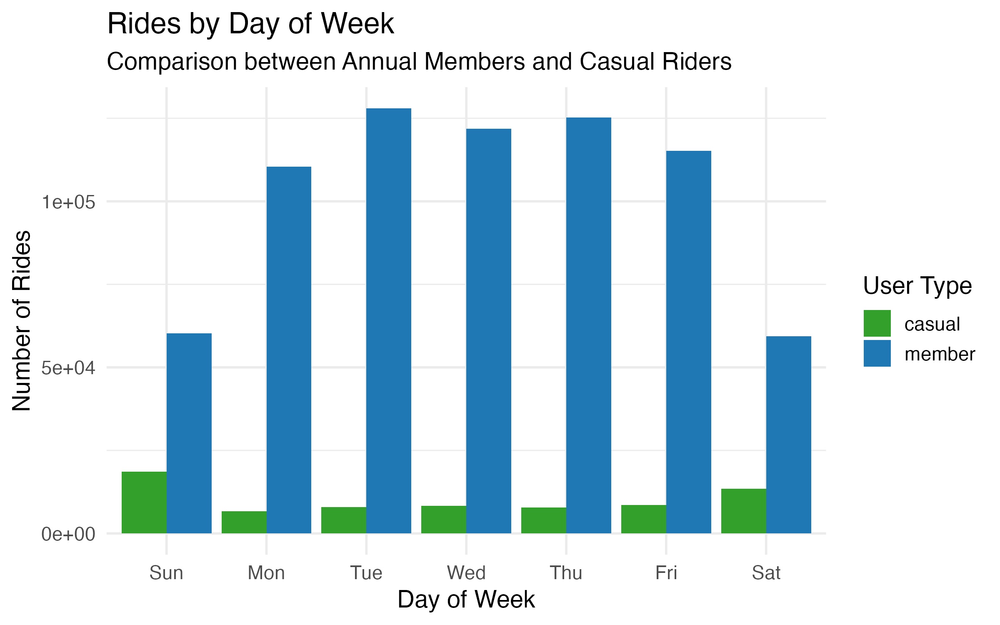
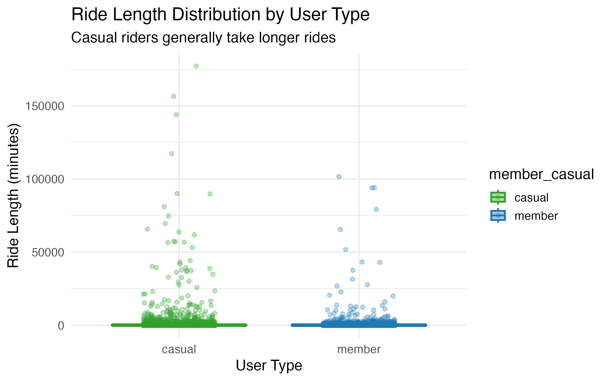
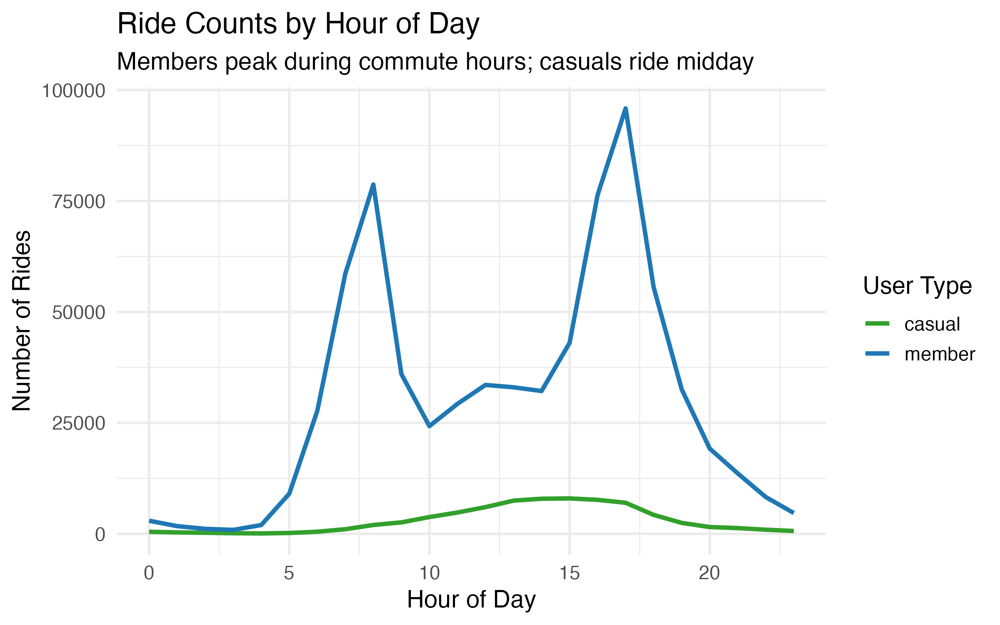
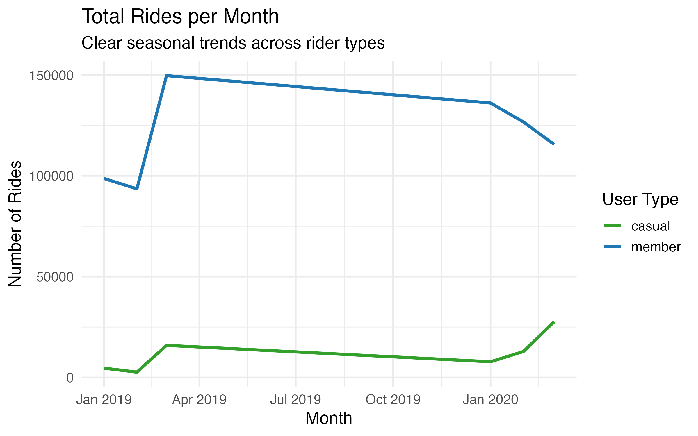
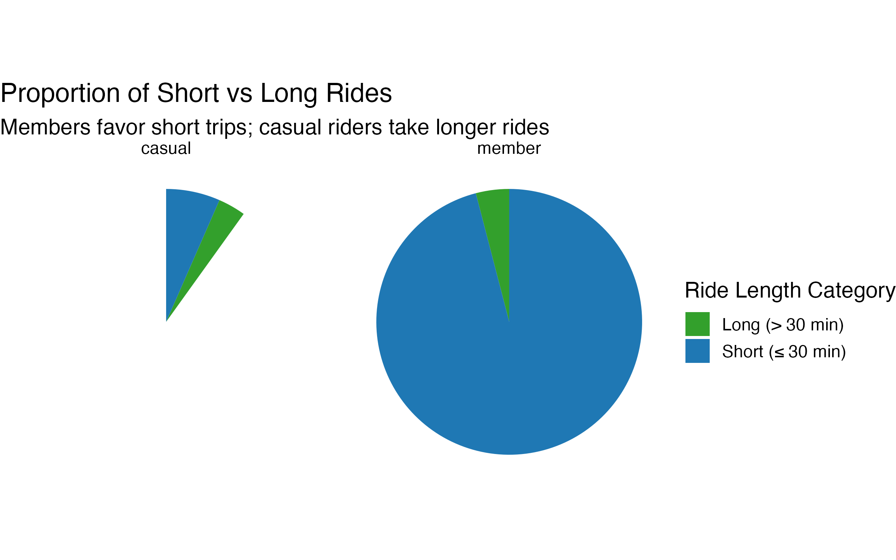
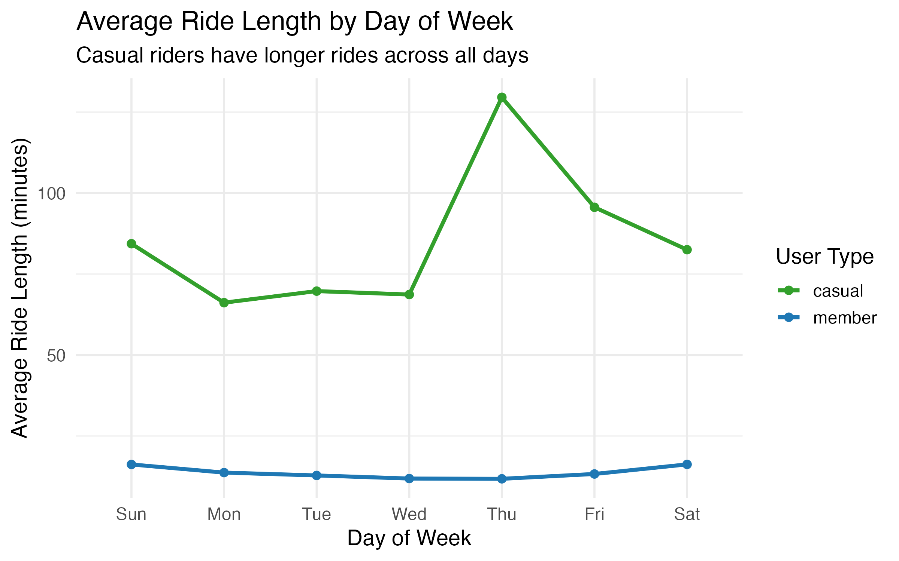
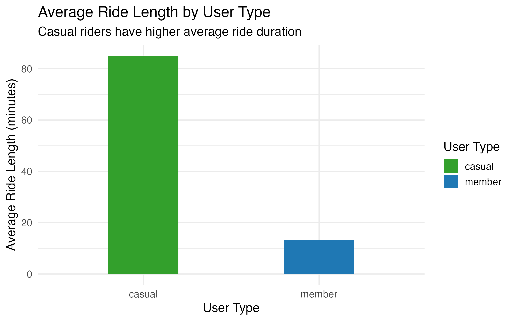
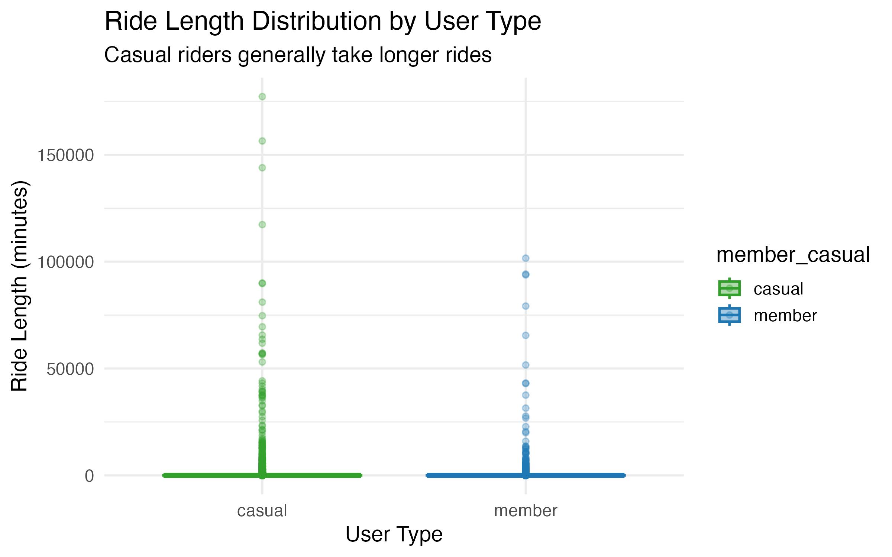

# Cyclistic Bike Share Analysis

## Overview
This project analyzes **Cyclistic bike share data** to understand how **annual members** and **casual riders** use the service differently. Insights were drawn from ride lengths, frequency, and temporal patterns.

---

## Communicating Findings

**Objective:** Show executives and stakeholders how members and casual riders behave differently.  

### Key Insights

**1. Rides by Day of Week**  
- Members ride mostly **Monday–Friday** → commuting behavior.  
- Casual riders peak **weekends** → leisure/recreational trips.  

**2. Ride Length Distribution (Boxplot)**  
- Members take **shorter rides** (≤30 min).  
- Casual riders take **longer rides** (>30 min).  

  

**3. Rides by Hour of Day**  
- Members ride during **commute peaks** (7–9 AM & 4–6 PM).  
- Casual riders ride more **midday/evening**, outside commute peaks.  

**4. Total Rides per Month**  
- Members ride consistently year-round.  
- Casual riders peak in **summer months**, suggesting seasonal leisure riding.  

**5. Short vs Long Rides (Pie Chart)**  
- **Short rides dominate members**.  
- Casual riders take a **higher proportion of long rides**.  

**6. Average Ride Length by Day**  
- Casual riders consistently ride **longer than members**, especially weekends.  

**7. Average Ride Length by User Type (Bar Chart)**  
- Casual riders’ rides are on average **20–25% longer** than members.  

**8. Ride Length Distribution – Vertical Points Boxplot**  
- Confirms longer rides for casual riders with **aligned points for clarity**.  

---

## Recommendations

**Final Conclusions:**
- Members primarily use bikes for **short weekday commuting**.  
- Casual riders are mostly **weekend or leisure riders**, taking longer rides.  
- Seasonal trends indicate casual riders peak during **summer months**.

### Top 3 Recommendations:

1. **Targeted Marketing:**  
   - Promote weekday commuting packages for potential members.  
   - Offer weekend or summer promotions to attract casual riders.  

2. **Operational Planning:**  
   - Increase bike availability during **weekday commute hours** in dense urban areas.  
   - Ensure bikes are available near **parks and tourist areas** on weekends.  

3. **Service Enhancements:**  
   - Introduce **loyalty/reward programs** for casual riders to convert them into members.  
   - Consider **dynamic pricing for longer rides** to optimize usage and revenue.  

---

## How to Run Analysis

1. Load the dataset `cyclistic_all.csv` in R.  
2. Run `scripts/cyclistic_analysis.R` to generate all visualizations.  
3. Visuals are saved in the `visuals/` folder.

---

